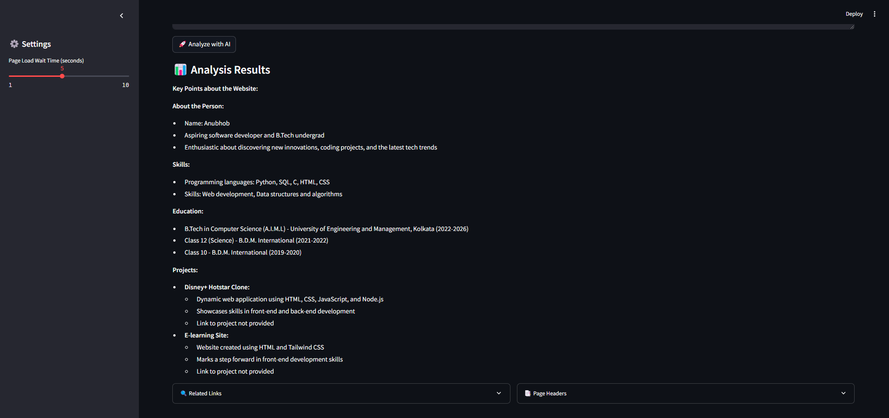
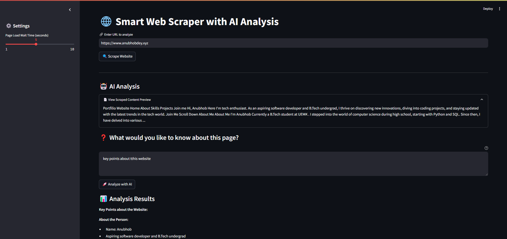

# 🌐 AI Web Scraper with Gemini

A powerful web scraping tool that combines Selenium-based web scraping with Google's Gemini AI for intelligent content analysis.



## ✨ Features

- **Advanced Web Scraping**: Extract content from dynamic websites using Selenium
- **AI-Powered Analysis**: Utilize Google's Gemini AI for content understanding
- **Interactive UI**: Clean, responsive Streamlit interface
- **Custom Queries**: Ask specific questions about scraped content
- **Smart Preview**: View condensed content with option to expand
- **Structured Data**: Extract links, headers, and meta information



## 🚀 Quick Start

### Prerequisites
- Python 3.8+
- Google Gemini API key
- Chrome browser

### Installation

1. Clone and setup:
```bash
git clone <repository-url>
cd WebScrapper-Ai
pip install -r requirements.txt
```

2. Create `.env` file:
```env
GEMINI_API_KEY=your_api_key_here
```

3. Run the app:
```bash
streamlit run main.py
```

## 💡 Usage Guide

1. **Enter URL**: Input the website URL you want to analyze
2. **Wait for Scraping**: The tool will extract content using Selenium
3. **Ask Questions**: Enter specific questions about the content
4. **View Analysis**: Get AI-powered insights and structured data

## 🛠️ Tech Stack

- **Frontend**: Streamlit
- **Scraping**: Selenium, BeautifulSoup4
- **AI**: Google Gemini
- **Data Processing**: Pandas

## 📝 Notes

- Ensure websites allow scraping
- Some sites may have anti-bot measures
- Large pages may take longer to process
- API key required for Gemini features

## 🤝 Contributing

Feel free to:
- Open issues
- Submit PRs
- Suggest features
- Report bugs

## 📜 License

MIT License - feel free to use in your projects!
